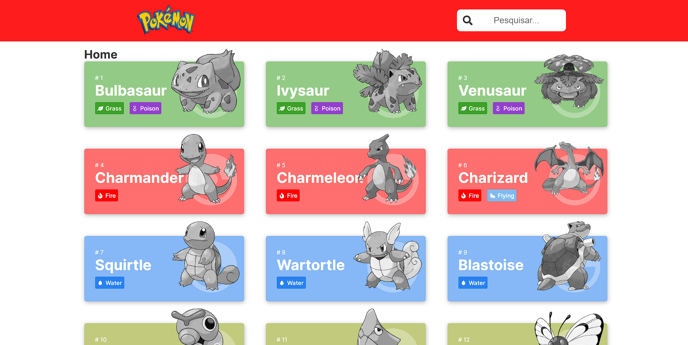

<h1 align="center">Pokédex</h1>

  

## 👁️‍🗨️ Visão Geral

Este é um projeto frontend que comunica com a api PokeAPI e criar uma listagem e visualização de pokémons

---

### Com ele é possível :

- [x] **Listagem dos pokémons**: Listar os pokémons com o uso da API REST.
- [x] **Ampliar a listagem dos pokémons**: Método para adicionar mais pokémons a lista, ampliando-se a quantia de pokémons mostrada ao usuário.
- [x] **Buscar pokémons**: Método para filtrar os pokémons a partir do seu nome.
- [x] **Efeito no cartão do pokémon**: Criar uma animação ao usuário apresentar foco no cartão do pokémon.
- [x] **Selecionar pokémon**: Criar uma página na aplicação com mais detalhes sobre o pokémon escolhido.
- [x] **Criar seções do pokémons**: Separar as informações do pokémon em três seções: Sobre, Estatísticas, Evoluções.
- [x] **Seção Sobre**: Dados básicos sobre o pokémon, como altura, peso, fraquezas.
- [x] **Seção Estatísticas**: Pontos de batalha do pokémon, como vida, ataque, defesa, velocidade, especial ataque e especial defesa.
- [x] **Seção Evoluções**: Construir a árvore de evolução do pokémon

---
### :rocket: Tecnologias
-  [NextJs](https://nextjs.org/)
-  [React](https://pt-br.reactjs.org/)
-  [React-Icons](https://react-icons.netlify.com/)
-  [Axios](https://github.com/axios/axios)
-  [TypeScript](https://www.typescriptlang.org/)